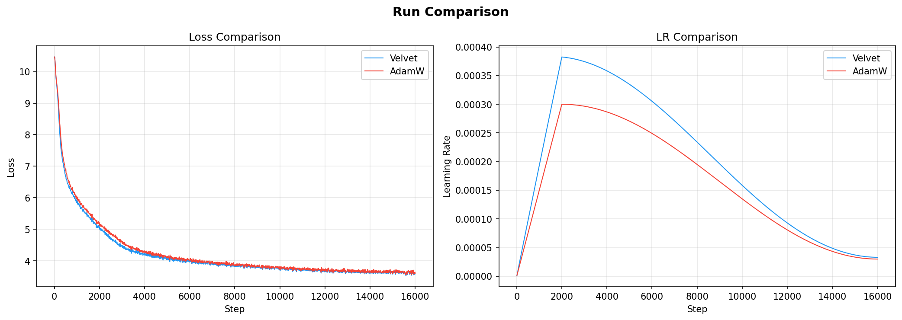

# R-Velvet


Multi-scale transformer that handles 1M+ token contexts by compressing intelligently, reasoning globally, and remembering selectively. Instead of brute-forcing quadratic attention, R-Velvet processes local windows cheaply, compresses them into abstract "concepts", and runs full attention only over these concepts. Theoretical estimates suggest this could be ~3800x cheaper than full quadratic for million-token sequences (currently being tested).

Comes with **VelvetOptimizer**, a custom optimizer that beats AdamW by adapting momentum (PGM) and learning rate (LVS) based on training dynamics. Converges faster and maintains the advantage through late training.

## What makes this different

Most long-context models either use sparse attention (which breaks global reasoning) or hierarchical processing (which loses fine-grained information). R-Velvet does both without the tradeoffs:

**Local-to-global pipeline:** Windowed attention captures syntax and local semantics (cheap, parallelizable). Cross-attention compressor learns to extract the important bits into a small set of concept vectors. Global reasoner runs full attention over concepts, enabling true long-range reasoning like "paragraph 3 contradicts paragraph 47". Finally, concepts get expanded back to token-level for next-token prediction.

**Adaptive computation routing (ACR):** Not all text segments need the same compute. News articles need deep processing, filler text can be skimmed. ACR routes each segment to SKIM (10% cost), PROCESS (50% cost), or FOCUS (100% cost) based on learned heuristics. Target distribution is 60/30/10, reducing average compute by ~65%.

**Iterative reasoning:** For hard prompts, the model can loop through the global reasoner multiple times with per-iteration LoRA adapters. Each pass refines the concepts further. A PonderNet-style halting unit learns when to stop (between 1-8 iterations). Adds minimal overhead (1.6% params) but enables multi-step reasoning chains.

## Architecture

```
tokens (1M+)
    │
    ▼
┌──────────────────┐
│  Token Embedding  │  vocab → d_model
└────────┬─────────┘
         │
         ▼
┌──────────────────┐
│  Local Encoder    │  Windowed attention O(n·w²)
│  (6 layers)       │  Captures syntax, local semantics
└────────┬─────────┘
         │ ← Optional: ACR residual gating (skip layers for SKIM segments)
         ▼
┌──────────────────┐
│ Segment Compressor│  1M tokens → ~500 concepts
│ (cross-attention) │  Learned compression, not pooling
└────────┬─────────┘
         │ ← Optional: Adaptive compression (1/4/16 concepts per segment)
         ▼
┌──────────────────┐
│  Global Reasoner  │  Full attention O(N²) where N ≈ 500
│  (8 layers)       │  "Paragraph 3 contradicts paragraph 47"
└────────┬─────────┘
         │ ← Optional: Iterative reasoning loop (LoRA + halting)
         ▼
┌──────────────────┐
│ Memory Controller │  Semantic read/write to external memory
│ (multi-hop)       │  Persists across chunks
└────────┬─────────┘
         │
         ▼
┌──────────────────┐
│    Expansion      │  Concepts → token-level (cross-attention)
│    + LM Head      │  → next-token logits
└──────────────────┘
```

## Quick start

```bash
# Clone and install
git clone https://github.com/thevesperhouse-hub/R-Velvet.git
cd R-Velvet
python -m venv venv && source venv/bin/activate
pip install -r requirements.txt

# Train BPE tokenizer (vocab size 32K)
python scripts/train_tokenizer.py --input corpus.txt --output data/velvet_tok

# Tokenize your corpus
python scripts/tokenize_data.py --input corpus.txt --output data/train.bin --tokenizer data/velvet_tok

# Train base model
python scripts/train.py training=phase1_pretrain model=base data=text
```

Training happens in three phases. Phase 1 pretrains the base model, Phase 2 enables ACR, Phase 3 adds iterative reasoning. Each phase resumes from the previous checkpoint with `training.resume_from=path/to/ckpt.pt`.

## VelvetOptimizer

AdamW with two adaptive mechanisms that adjust to training dynamics:

**PGM (Perplexity-Guided Momentum)** adapts beta1 based on where the model is in training. Early on when the model is random, momentum stays normal. During active learning (mid-training), momentum drops to react faster to gradients. Near convergence, momentum increases for stability. Uses a simple U-curve based on loss/max_entropy ratio. Zero overhead.

**LVS (Loss-Velocity Scaling)** boosts the learning rate when loss is actively dropping, reduces it when loss stagnates or worsens. Tracks two EMAs of log(loss): a fast "current" EMA and a slow "anchor" EMA. When current < anchor, the model is improving → boost LR. When current > anchor, the model is worsening → reduce LR.

Log-space is critical. In linear space, as loss decreases (e.g., 8.0 → 4.0), the absolute gap between EMAs shrinks even if the relative improvement rate stays constant. This caused the signal to decay after ~300 steps. In log-space, a constant improvement rate produces a constant EMA gap.

EMA windows scale with total training steps (Chinchilla-inspired). Current window is 2% of max_steps, anchor starts at 10% and grows to 25%. For a 16K step run, current=150, anchor grows from 1200→4000. This keeps the signal stable across different run lengths.

Asymmetric momentum: when the signal says "boost", LR ramps up fast (momentum 0.8). When the signal says "reduce", LR decays slowly (momentum 0.995, half-life ~140 steps). This holds the boost longer.

```python
from rvelvet.training.velvet_optimizer import VelvetOptimizer

optimizer = VelvetOptimizer(
    model.parameters(),
    lr=5e-4,
    betas=(0.9, 0.999),
    weight_decay=1e-3,
    max_grad_norm=1.0,
    entropy_adaptive=True,      # enable LVS
    perplexity_guided=True,     # enable PGM
)

optimizer.set_training_steps(max_steps=16000)

for step in range(max_steps):
    loss = model(batch)
    loss.backward()
    optimizer.clip_grad_norm_()
    optimizer.step()
    optimizer.zero_grad()

    optimizer.set_loss_metrics(loss.item(), vocab_size=32000)

    # Monitor adaptive mechanisms
    print(f"lr={optimizer.effective_lr:.2e} "
          f"beta1={optimizer.effective_beta1:.3f} "
          f"lvs={optimizer.lr_scale:.3f}")
```

To use AdamW instead, set `training.optimizer=adamw` in configs.

### Velvet vs AdamW on 50M params, 16K steps



Velvet converges faster and maintains a consistent advantage throughout training. Final loss: **3.59** (Velvet) vs **3.61** (AdamW). The LR plot shows Velvet maintaining a smooth 15-20% boost above the base cosine schedule.

Visualize your own runs:

```bash
python scripts/plot_run.py outputs/phase1/metrics.csv outputs/adamw/metrics.csv --labels Velvet AdamW
```

## Model configs

| Config | d_model | Layers (local/global) | Heads | Params | Use case |
|---|---|---|---|---|---|
| `small` | 256 | 4 / 4 | 4 / 4 | ~5M | Debug, fast iteration |
| `base` | 384 | 6 / 8 | 6 / 8 | ~50M | Production |

Optional modes add minimal overhead: ACR adds ~0.7% params (scanner), iterative reasoning adds ~1.6% params (LoRA bank + halting unit).

## Training phases

**Phase 1 — Base pretraining.** Standard LM training. All params trained with cross-entropy. LR 3e-4, cosine decay, 2K warmup. Takes ~100K steps on CulturaX to reach Chinchilla optimal (~20:1 tokens/params ratio).

**Phase 2 — ACR finetuning.** Enables adaptive routing. Loads Phase 1 checkpoint with `strict=False` to add new modules. Base params get LR×0.1, ACR params get full LR. Loss is CE + load_balance + entropy + compute_cost. Takes ~50K steps.

**Phase 3 — Iterative reasoning.** Freezes base model, only trains LoRA bank + halting unit + iteration embeddings. Loss is CE + halting + deep_supervision (each iteration's output gets supervised). Takes ~30K steps.

Each phase resumes from the previous: `training.resume_from=outputs/phase1/ckpt_final.pt`

## Configuration

Hydra configs live in `configs/`. Override anything from CLI:

```bash
# Smaller batch, longer run
python scripts/train.py training=phase1_pretrain training.batch_size=16 training.max_steps=20000

# Use small model for quick tests
python scripts/train.py training=phase1_pretrain model=small

# Enable wandb logging
python scripts/train.py training=phase1_pretrain training.wandb=true training.wandb_project=my-project
```

Debug mode runs 500 steps with 10-step logging:

```bash
python scripts/train.py training=phase1_pretrain training.debug=true
```

## Kernel backends

VelvetOptimizer has three backends, auto-detected by priority:

**Triton** (fastest): Fused kernel, single kernel launch per parameter update. Requires `triton` package + CUDA GPU.

**CUDA** (fallback): Native CUDA kernel via cpp_extension. ~80% of Triton speed.

**PyTorch** (baseline): Pure PyTorch fallback for CPU or when extensions aren't available.

The optimizer prints which backend is active at training start.

## Project structure

```
R-Velvet/
├── rvelvet/
│   ├── model.py                     # Main model
│   ├── layers/                      # All architecture components
│   ├── data/                        # Dataset loaders
│   └── training/
│       ├── trainer.py               # Training loop
│       ├── velvet_optimizer.py      # Custom optimizer
│       └── kernels/                 # Triton/CUDA kernels
├── configs/                         # Hydra configs
├── scripts/
│   ├── train.py                     # Main entry point
│   ├── train_tokenizer.py           # BPE training
│   ├── tokenize_data.py             # Corpus → .bin
│   ├── plot_run.py                  # Visualize training
│   └── download_culturax.py         # Dataset downloader
└── tests/                           # Unit tests
```

## Tests

```bash
python tests/test_architecture.py     # Shapes, gradients, memory
python tests/test_acr.py              # Routing, load balance
python tests/test_iterative_reasoning.py  # LoRA, halting
```

## License

MIT
